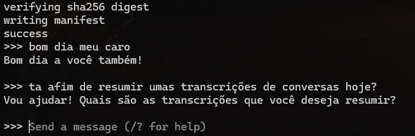

# 🔔 Zolt Summarizer

O **Zolt Summarizer** é uma ferramenta robusta de processamento de áudio concebida para transformar gravações de reuniões e conversas em resumos inteligentes e estruturados.

O pipeline integra tecnologias de ponta para realizar a transcrição (Whisper), identificação de oradores (Pyannote) e geração de resumos através de LLMs locais (Ollama).

## 🚀 Funcionalidades Principais

  * **Transcrição de Alta Precisão:** Utiliza o modelo **Whisper** (OpenAI) para converter áudio em texto.
  * **Diarização de Oradores:** Identifica "quem falou o que" utilizando o **Pyannote Audio**.
  * **Resumos com IA Local:** Integração com o **Ollama** para gerar resumos utilizando modelos como Llama3 ou Qwen.
  * **Pipeline Modular:** Sistema orquestrado pelo módulo `ArcanaFlow` (Nayahath) para logs detalhados e gestão de fluxo.

## 📋 Pré-requisitos

Para executar este projeto, necessitará de ter instalado:

  * [Docker](https://www.docker.com/) e Docker Compose
  * [FFmpeg](https://ffmpeg.org/) (recomendado para manipulação de ficheiros de áudio)
  * Uma conta no **Hugging Face** e um token de acesso (para descarregar os modelos do Pyannote).

## 🛠️ Instalação e Configuração

### 1\. Preparar o Ambiente Docker

O projeto utiliza o Docker para gerir as dependências do Python e o serviço do Ollama.

Clone o repositório e construa os contentores:

```bash
docker-compose up -d --build
```

Este comando irá iniciar dois serviços:

  * `zolt_summarizer`: O ambiente Python com as bibliotecas necessárias.
  * `ollama_backend`: O servidor para os modelos de linguagem.

### 2\. Configurar o Modelo de IA (Ollama)

Antes de iniciar o resumo, é necessário descarregar o modelo de linguagem que deseja utilizar (ex: llama3, qwen, mistral). Execute o seguinte comando para descarregar e testar o modelo:

```bash
docker exec -it ollama_backend ollama run llama3
```

> **Nota:** Pode substituir `llama3` por qualquer outro modelo disponível na biblioteca do Ollama.
> Para sair do chat do Ollama, digite `/bye`.



### 3\. Configurar o Projeto (`zolt_config.py`)

Edite o ficheiro `zolt_config.py` na raiz do projeto com as suas configurações:

```python
HUGGING_FACE_TOKEN="O_SEU_TOKEN_HUGGING_FACE"  # Necessário para o Pyannote
FILE_PATH="./caminho/para/o/seu_audio.wav"     # O ficheiro de áudio a processar
SUMMARIZER_MODEL="llama3"                      # O modelo que descarregou no passo anterior
TIMESTAMPS=False                               # Definir como True para incluir carimbos de tempo no resumo
```

> **Importante:** O Pyannote requer que aceite os termos de utilização dos modelos `pyannote/speaker-diarization` e `pyannote/segmentation` no site do Hugging Face para que o seu token funcione.

## ▶️ Como Utilizar

### 1\. Aceder ao Contentor

Entre no terminal do contentor principal onde o script será executado:

```bash
docker exec -it zolt_summarizer /bin/bash
```

### 2\. Instalar Dependências

Garanta que todas as bibliotecas Python estão atualizadas:

```bash
pip install -r requirements.txt
```

### 3\. Executar o Pipeline

Inicie o processo de sumarização executando o script principal:

```bash
python flow.py
```

O sistema, gerido pela entidade "Nayahath", irá apresentar o progresso no terminal, passando pela diarização, transcrição e, finalmente, o resumo.

📂 **Resultados:** Os ficheiros gerados (transcrições e resumos) serão guardados na diretoria `outputs/`, organizados por data e hora.

-----

## 🧩 Arquitetura do Sistema

O Zolt Summarizer é composto por quatro entidades principais que colaboram para gerar o resultado final:

1.  **🟣 Nayahath (ArcanaFlow):**
    A coordenadora do sistema. É responsável por gerir o fluxo de execução, instanciar as interfaces e apresentar os logs coloridos e detalhados no terminal.

2.  **🔵 Diarizer:**
    Responsável por identificar os oradores. Utiliza o **Pyannote** para segmentar o áudio e atribuir etiquetas (ex: SPEAKER\_00, SPEAKER\_01) a cada intervalo de fala.

3.  **🟢 Transcripter:**
    Utiliza o **Whisper** (modelo `turbo` por defeito) para converter o áudio em texto bruto, ignorando quem está a falar e focando-se apenas no conteúdo.

4.  **🟡 Summarizer:**
    Recebe os dados sincronizados do *Diarizer* e do *Transcripter*. Envia o texto estruturado para o **Ollama**, instruindo o modelo a gerar um resumo contextualizado, atas ou responder a perguntas específicas sobre a conversa.

-----

## 💡 Dicas Úteis

### Extrair áudio de vídeo

Se tiver uma gravação em vídeo (MP4), utilize o **FFmpeg** para extrair o áudio no formato correto (WAV 16kHz mono) antes de o processar:

```bash
ffmpeg -i "video_reuniao.mp4" -vn -acodec pcm_s16le -ar 16000 -ac 1 "audio_processado.wav"
```

### Testar apenas o Resumo

Se já tiver o texto transcrito e quiser apenas testar diferentes prompts ou modelos de LLM sem reprocessar o áudio, pode editar e executar o script de teste:

```bash
python teste_ollama.py
```